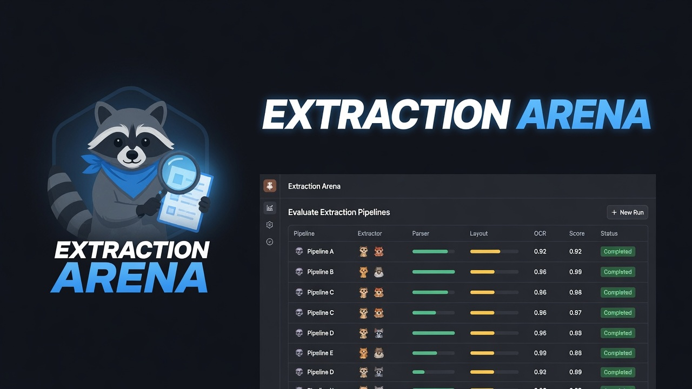

# Extraction Arena

<p>
  <a href="https://huggingface.co/datasets/martincousseau/Cybertruck-Rescue-Sheet"></a>
  &nbsp;&nbsp;
  <a href="https://github.com/martin-cousseau/extraction-arena"></a>
  &nbsp;&nbsp;
  <a href="https://youtu.be/QXWN8WyvPmI"></a>
</p>

Eval harness for document extraction pipelines on first-responder rescue sheets. Upload a PDF, paste its golden JSON, then run **DocAI** (LlamaExtract, native) — or the deprecated GLM-5V-Turbo / GPT-5.4 mini / Grok 4.5 vision adapters. Each field is scored against a versioned `rescue-sheet-ev-v1.1` record. Datasets and runs live in the browser (IndexedDB) and survive restarts.

The seed document is Tesla’s public 4-page [Cybertruck rescue sheet](https://digitalassets.tesla.com/tesla-contents/image/upload/Cybertruck-Rescue-Sheet.pdf). The structured gold is on [Hugging Face](https://huggingface.co/datasets/martincousseau/Cybertruck-Rescue-Sheet). Walkthrough: [YouTube](https://youtu.be/QXWN8WyvPmI). Fixture wording taken from that sheet remains Tesla’s.

## Quick start

`backend/` and `frontend/` are independent packages. From the repo root:

```bash
npm install
npm run install:all
cp frontend/.env.example frontend/.env   # optional: deprecated vision VITE_* keys
cp backend/.env.example backend/.env     # add LLAMA_CLOUD_API_KEY for DocAI
npm run dev
```

- Frontend → http://localhost:5173
- Backend → http://localhost:3001 (`POST /api/extract`, `POST /api/llm`, `POST /api/pipelines/docai`)

Or run them separately: `npm run dev --prefix backend` and `npm run dev --prefix frontend`.

Open http://localhost:5173 → **Datasets → Create dataset** → name, PDF, golden JSON → **Run DocAI**. Results land on **Dashboard** and **Runs**.

## Docker

```bash
cp .env.example .env   # add LLAMA_CLOUD_API_KEY (and optional deprecated VITE_* keys)
docker compose up --build
```

Frontend is at http://localhost:5173 (nginx proxies `/api/*` to the backend). Backend is also on http://localhost:3001.

## Canonical contract

Pasted OEM JSON and model output are normalized into `rescue-sheet-ev-v1.1` before scoring. Scoring uses a derived flat projection of that record, not the raw paste. Ingest paths, adapters, and the empty extraction skeleton: [`frontend/src/lib/canonical/README.md`](frontend/src/lib/canonical/README.md).

## Environment

Backend (`backend/.env`):

| Var | Purpose |
|---|---|
| `LLAMA_CLOUD_API_KEY` | Native DocAI pipeline (LlamaExtract). Never prefix with `VITE_`. |
| `LLAMA_CLOUD_PROJECT_ID` | Optional Llama Cloud project |
| `PORT` | Optional, default `3001` |

Frontend (`frontend/.env`) — deprecated vision adapters only:

| Var | Purpose |
|---|---|
| `VITE_ZAI_API_KEY` | GLM-5V-Turbo |
| `VITE_OPENAI_API_KEY` | GPT-5.4 mini (and semantic judge) |
| `VITE_XAI_API_KEY` | Grok 4.5 |

Vite exposes `VITE_*` vars to the browser. Those keys are forwarded through `/api/llm`. DocAI does not use them.

The UI is BoardUI (React 19, Tailwind v4, React Aria) on Vite — not shadcn.

Repo conventions: [`AGENTS.md`](AGENTS.md).

## License

MIT. See [LICENSE](LICENSE).
